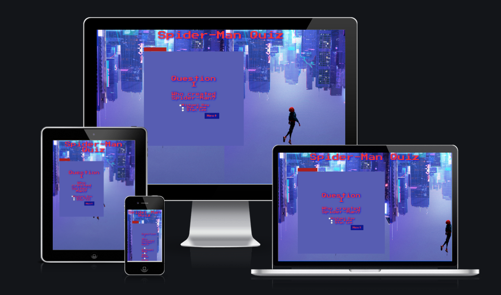
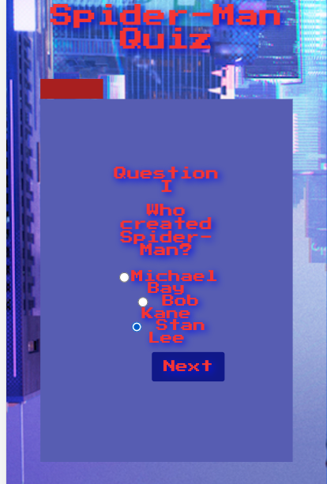
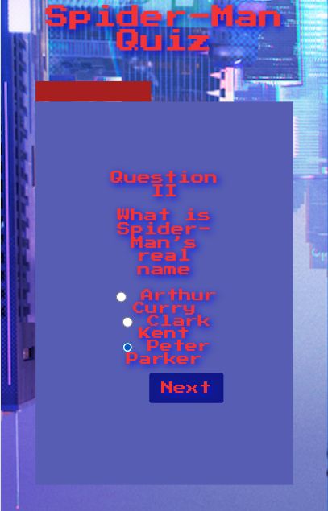
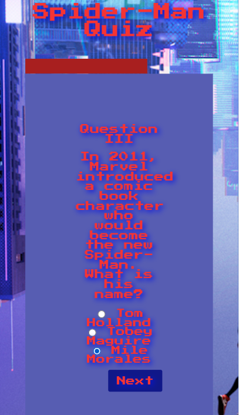
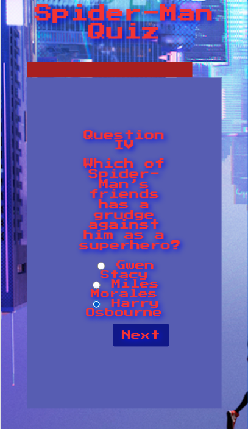
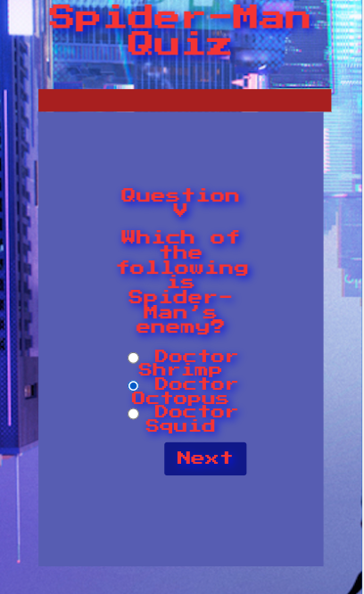
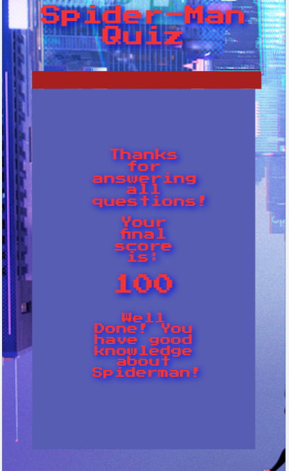
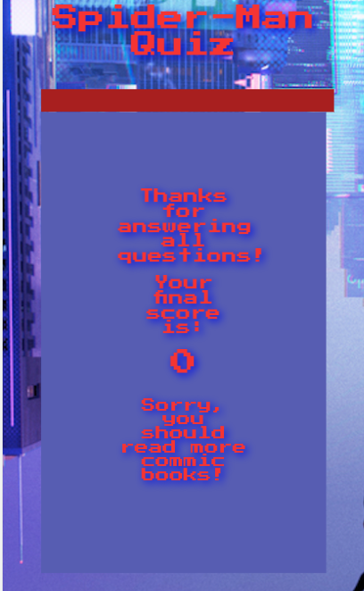
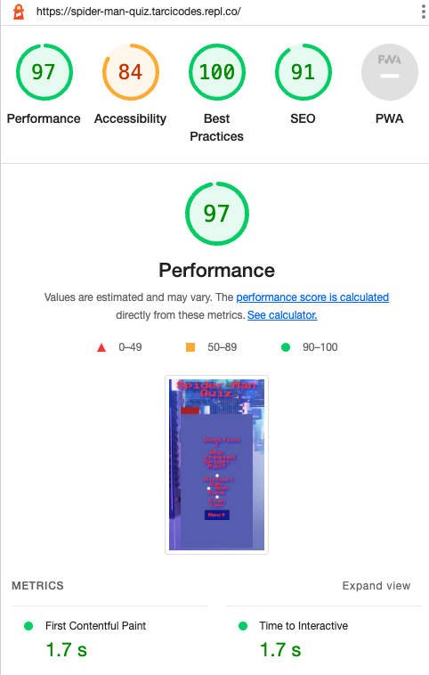

# SPIDER-MAN QUIZ:

This website is created to users who want to play an online quiz to test their general knowledge about Spider-Man. The main goal of this project is provide a challenging quiz of 5 questions to entertain online users. In the end of the Quiz, users will be able to se their scores and also receive a positive or negative feedback about their knowledge about Spider-Man.

## FEATURES:
Here we can see all 5 questions, final score examples and also (positive/negative) feedbacks:

## TESTING: 

* I tested that this page works in different browsers: Chrome, Firefox, Safari.
* I confirm that this project is responsive, looks good and functions on all standard screen sizes using the dev tools device toolbar.
* I confirm that every field and button works.

### Validator Testing:
* HTML: No errors were returned when passing through the official W3C validator
* CSS: No errors were found when passing through the official (Jigsaw) validator
* JavaScript: No errors were found when passing through the official (JSHint) validator

### Lighthouse Feature:

## DEPLOYMENT:
The site was deployed to GitHub pages. The steps to deploy are as follows:
* In the GitHub repository, navigate to the Settings tab
* From the source section drop-down menu, select the Master Branch
* Once the master branch has been selected, the page will be automatically refreshed with a detailed ribbon display to indicate the successful deployment.

## CREDITS:
* Main Font: “Press Start 2P” from https://fonts.google.com/
* Page Icon: https://iconarchive.com/
* The background photo was took from: https://pxhere.com/
* Project inspired in the Quiz: https://www.beano.com/posts/the-ultimate-spider-man-quiz
